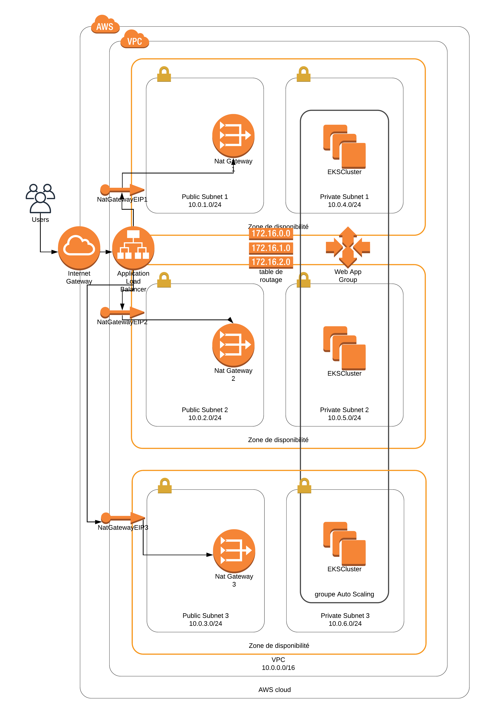
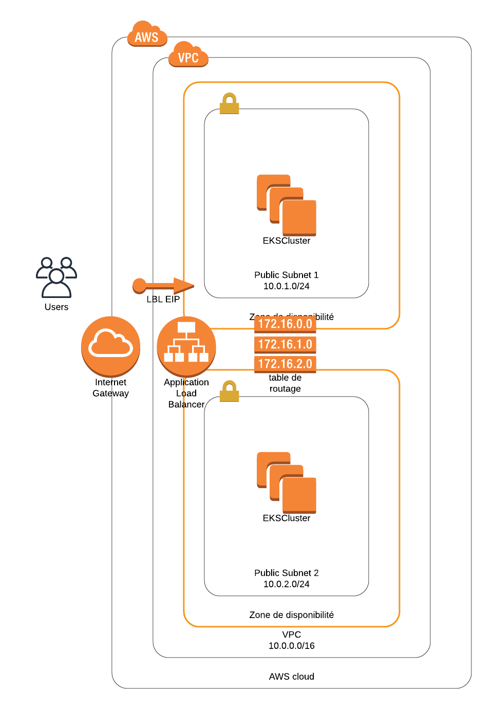
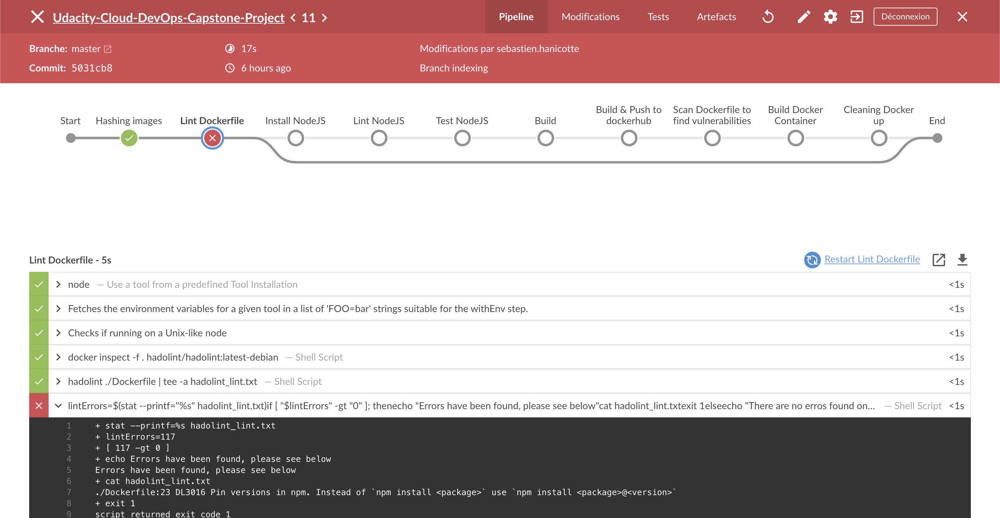
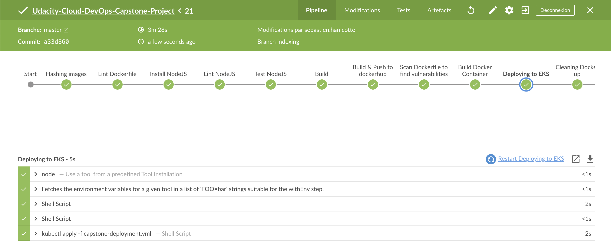

[](https://circleci.com/gh/Sebastien-Hanicotte/Udacity-Cloud-DevOps-Capstone-Project/)

# Udacity-Cloud-DevOps-Capstone-Project
This repository will be used to validate the Capstone Project of Udacity Cloud DevOps Classroom

# Overview of the Project
As I understood the Capstone Project, it is to look at a realistic situation
in which, as a *Cloud DevOps* consultant, we could be facing.

## The "Web" Project 
At first, I did choose to deploy a single HTML webpage, as we already
did during the classroom.

In a second thought, I should perhaps stay on this idea, but 
I chose to select a more complex application which was here
a NodeJS app (original source : https://github.com/remarkablemark/react-blog-example)

## The Network Structure
With this web project, I began to run on a complex and secure
network system (which I have never been able to test before)

So my 1st idea was similar as this screenshot : 


Well, this design which was perhaps secure but complex too pushed
my limits too far, discovering some limitations with Amazon Accounts
too.

I wasn't able to add a Bastion in each Public Subnet allowing me
to access via SSH each Privates Subnet because it implies too much
EIP (by default, the Amazon Accounts are limited to 5 EIP for EC2
instances and I needed at least 6).

So I keep this network idea in my mind and will later try it again
to continue learning.

The 2nd Network Scheme is this time much more simplified as followed :


## CloudFormation

Part of the Capstone Project is also to deal with CloudFormation script.

I first worked on the 1st network design, you'll be able to have a
look at some of the files I was trying to deal with like : 

- [ ] [~~Network configuration file~~](infra/capstone-network.yml)
- [ ] [~~Network parameter file~~](infra/capstone-network-parameters.json)
- [ ] [~~Server configuration file~~](infra/capstone-servers.yml)
- [ ] [~~Server parameter file~~](infra/capstone-servers-parameters.json)

And then, because I wasn't succesful (and the deadline was close),
I had to switch to those configuration files :

- [x] [Network and EKS configuration file](infra/capstone-light-network.yml)
- [x] [Network and EKS parameter file](infra/capstone-light-network-parameters.json)

I used those command to deploy this configuration (could also used 
into Jenkins but haven't given it a try yet)

```
aws cloudformation create-stack --stack-name Capstone \
   --template-body file://capstone-light-network.yml \
   --parameters file://capstone-light-network-parameters.json \
   --capabilities CAPABILITY_NAMED_IAM
```

This command allowed me to create the CloudFormation stack and wait
a little during the creation processus.

## Amazon EKS

This project also needed to be deployed to a Kubernetes infrastructure.

Into Amazon, 2 possibilities was available : 
* dealing with kubernetes inside EC2 self deployed
* using the Amazon EKS to deploy Cluster + Worker Nodes

This is this 2nd possibility I chose and after a lot of try and fail, managed
to deal with the EKS Cluster / Worker configuration and deployed
the application using such kind of command : 

```
aws eks update-kubeconfig --region eu-west-1 --name capstone-cluster
kubectl apply -f capstone-deployment.yml
``` 

This command is launch via the Jenkinsfile and in order to have the
most up-to-date version, I used a sed command to set the 
latest GIT Version (used Hash value)

## Dealing with Jenkins

As one of the topic was to deal with a CI/CD functionnality, I used
Jenkins as we already used it during the classroom.

At first, I tried to configure it on a t2.micro EC2 instance, which
was fine, except when the project began to be more complex and
the instance began to be overwhelmed by all the CPU sollicitation
(load increased to more than 50).

I had finally to install Jenkins as a docker application on my
computer which had more memory and CPU power than the initial t2.micro EC2.

You'll be able to have a look at the [Jenkinsfile](Jenkinsfile) and notice
I wanted to be able to : 
- [x] Lint the Dockerfile
- [x] Install NodeJS dependencies for the Project chosen
- [x] Lint the NodeJS project
- [x]  Test the NodeJS project
- [x]  Build the NodeJS project as a production ready
- [x]  Build and Push the docker image (using the [Dockerfile](Dockerfile))
- [x]  Scan the docker image for vulnerabilities with Aqua Microscanner (this part is just informative, and is configured as unrequired for successful build)
- [x]  Check if the docker image is able to be launched
- [x]  Deploy the image to the EKS Cluster
- [x]  Clean and Finish




## CircleCI

Just because those services exists, I took the pleasure to add the
CircleCI shield which test only the NodeJS application code.

## TODO

In order to continue learning here is below a TODO list :
- [ ] Dealing with the much complex network structure
- [ ] Adding the CloudFormation script into the Jenkins Pipeline
- [ ] Using the Route53 AWS Service to make an easy to serve URI towards the LBL
- [ ] Look for a better solution to deploy the latest build version of the project via Kubernetes
